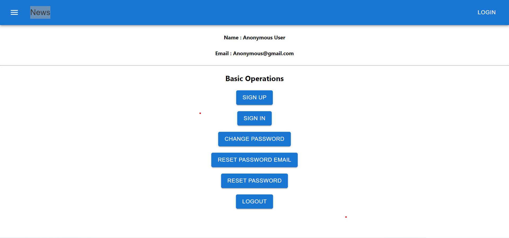

# User-Authentication-using-React-Django

This application provides full-stack web authentication, with the frontend built using ReactJS and the backend built with Django REST Framework. Users can register and login through the application, and authentication is managed using JWT tokens. If a user is currently logged in, they can also update their password. In the event that a user forgets their password, they can use the "change password with email" feature, which allows them to receive an email with instructions on how to reset their password.
Additionally, the application's frontend has been developed using the Material UI library, providing a basic, user-friendly interface.

## Live Project Link

The project is hosted on Netlify and can be accessed using the following link - https://userauthwithreact.netlify.app/

## Features

- Full-stack web authentication
- User registration and login
- JWT token-based authentication
- User password update functionality
- "Change password with email" feature for resetting passwords
- User-friendly Material UI frontend

## Technologies Used

The following technologies were used in the development of this project:

- ReactJS - A JavaScript library for building user interfaces
- Django - A high-level Python web framework
- Django REST Framework - A powerful and flexible toolkit for building Web APIs
- JSON Web Tokens (JWT) - A compact, URL-safe means of representing claims to be transferred between two parties
- Material UI - A popular React UI framework

## Conclusion

The User-Authentication-using-React-Django project demonstrates proficiency in building a full-stack web authentication system using React, Django, and Django REST Framework. The application delivers user-friendly features such as password update functionality and a "change password with email" feature for resetting passwords. The Material UI frontend provides a basic, yet elegant interface for users.
